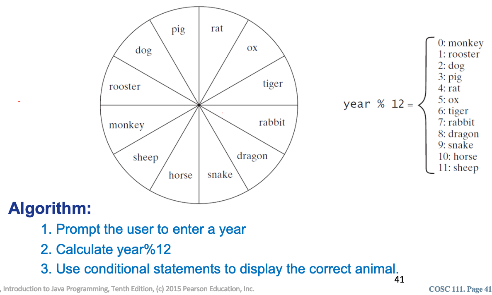

# Lecture Activity 6

##  Instructions

In lecture activity 6, we will continue writing Java programs taking in user inputs and also include some conditional statements. 

## General instructions for creating Java files

For each of the following Tasks, create a separate Java file called task1.java, task2.java, task3.java etc... 

Remember, to create a new file, first navigate to this directory locally using `cd path/to/this/repo` and then type: `code task1.java`.
This will open a new file called `task1.java` in Visual Studio Code.
You can also work in Geany, or Eclipse, it's your choice.


```
public class task1 {

	public static void main(String[] args) {
	  // Enter your code
	}
  
}
```

Don't forget to change the name of the public class method for each file!

## Task 1: Chinese Zodiac

Write a program that prompts the user to enter a year and displays the animal for the year. 

*Hint: Here is a sketch of the solution*:

- Prompt the user to enter a year
- Use the remainder operator (%) to determine the animal for the year
- Use conditional statements to display the correct animal.



Note that there is more than one way to accomplish this task.

## Task 2: Conditional Operators

Rewrite the following **if** statements using the conditional operator.

### Task 2A

```
if (x % 2 == 0)
    s = “even”;
else
    s = “odd”;
```

### Task 2B
```

if (y >= 10)
    x = 100;
else
    x = -100;
```

## Task 3: Conditinal Operators II 

Rewrite the following conditional expressions using **if-else** statements

### Task 3A

```
score = (x > 10) ? 3 * scale : 4 * scale;
```

### Task 3B
```
System.out.println( (number % 3 == 0) ? i : j );
```

## Task 4: Update your README file 

If you named your files as suggested above, you do not have to do anything in this section.
If you named your files differently, please update the links below to make sure they work.

[Task 1 Java file](./Task1.java)

[Task 2A Java file](./task2A.java)

[Task 2B Java file](./task2B.java)

[Task 3A Java file](./Task3A.java)

[Task 3B Java file](./Task3B.java)
